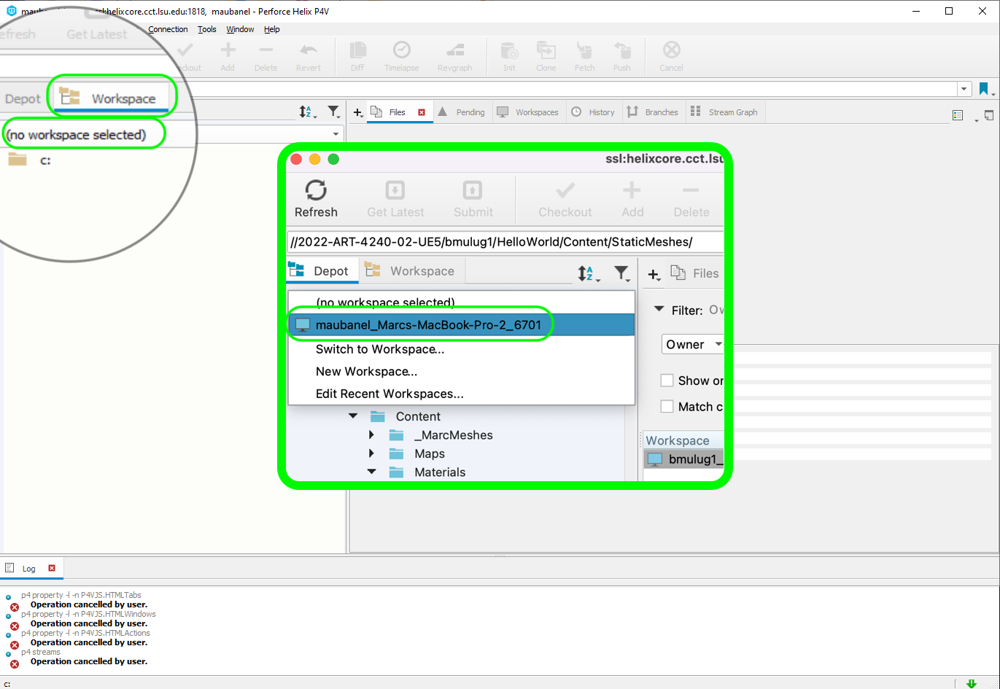
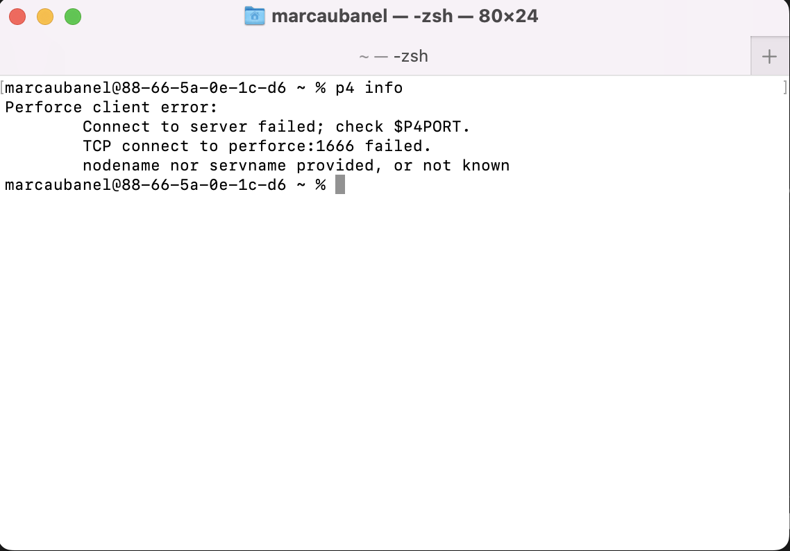
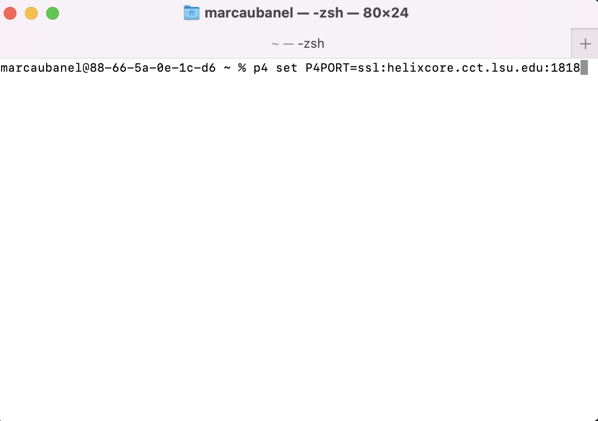
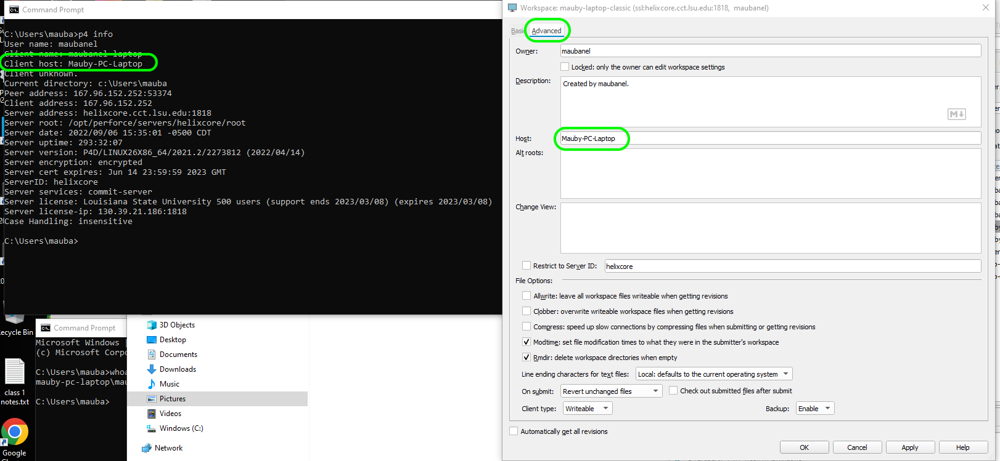
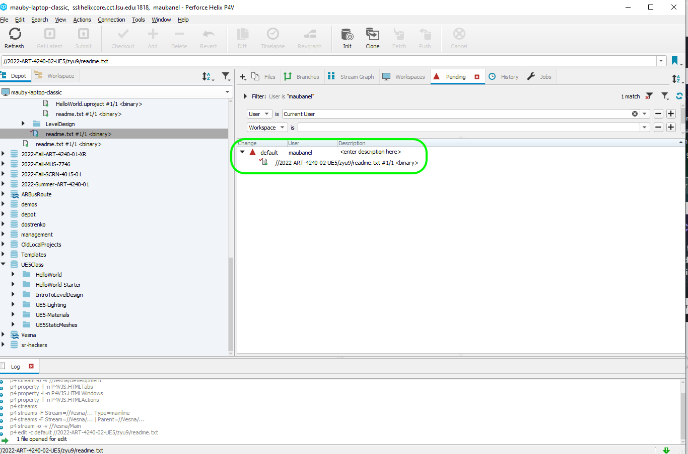

### UP5 Perforce Issues

Here is a list of common issues when using Perforce and Unreal Engine 5

 

---

##### `Step 1.`\|`ITL`|:small_blue_diamond:

If you are not logged into a workspace, Unreal will sometimes say source control is connected but it is not conected to any or the correct workspace.  Go to P4V and if you see that there is no workspace log into on.

##### `Step 2.`\|`ITL`|:small_blue_diamond: :small_blue_diamond: 

If you are logged into **P4V** but Unreal is not able to log into perforce.  Make sure that the command line perforce sees that you are registered to a valid port.  Open up **Command Prompt** and make sure that you can connect to the perforce server by typing `p4 info`.  The example below returned a failure to connect.

To connect to the server you need to type `p4 set P4PORT=ssl:helixcore.cct.lsu.edu`.

Now you should see valid information.  Also confirm that your **Host** (in P4V | Advanced) is the same as the host on your computer using command line (p4 info) listed as your **P4 Host**.  If your command line is wrong, you can reset your host by typing `p4 set P4HOST=HOSTNAME`.

##### `Step 3.`\|`ITL`|:small_blue_diamond: :small_blue_diamond: :small_blue_diamond:

If you can't loginto your workspace on a given computer you need to make sure that the host is correclty set up.  Compate the **Host** in (P4V | Advanced) with the **P4 Host** listed when running `p4 info` in command line. If your command line is wrong, you can reset your host by typing `p4 set P4HOST=HOSTNAME` or reset the host name in P4V.

##### `Step 4.`\|`ITL`|:small_blue_diamond: :small_blue_diamond: :small_blue_diamond: :small_blue_diamond:

Make sure at the end of every work session on any computer that you save all and submit changes from Unreal.  It is also very important to make sure that you have nothing left in your **Pending** list.  This means that it is checked out and will not be available on another computer. If you do have outstanding items you can press **Submit** in **P4V** and it will submit them and release them for use on your other computer.

##### `Step 5.`\|`ITL`| :small_orange_diamond:

##### `Step 6.`\|`ITL`| :small_orange_diamond: :small_blue_diamond:

##### `Step 7.`\|`ITL`| :small_orange_diamond: :small_blue_diamond: :small_blue_diamond:

##### `Step 8.`\|`ITL`| :small_orange_diamond: :small_blue_diamond: :small_blue_diamond: :small_blue_diamond:

##### `Step 9.`\|`ITL`| :small_orange_diamond: :small_blue_diamond: :small_blue_diamond: :small_blue_diamond: :small_blue_diamond:

##### `Step 10.`\|`ITL`| :large_blue_diamond:

##### `Step 11.`\|`ITL`| :large_blue_diamond: :small_blue_diamond: 

##### `Step 12.`\|`ITL`| :large_blue_diamond: :small_blue_diamond: :small_blue_diamond: 

##### `Step 13.`\|`ITL`| :large_blue_diamond: :small_blue_diamond: :small_blue_diamond:  :small_blue_diamond: 

##### `Step 14.`\|`ITL`| :large_blue_diamond: :small_blue_diamond: :small_blue_diamond: :small_blue_diamond:  :small_blue_diamond: 

##### `Step 15.`\|`ITL`| :large_blue_diamond: :small_orange_diamond: 

##### `Step 16.`\|`ITL`| :large_blue_diamond: :small_orange_diamond:   :small_blue_diamond: 

##### `Step 17.`\|`ITL`| :large_blue_diamond: :small_orange_diamond: :small_blue_diamond: :small_blue_diamond:

##### `Step 18.`\|`ITL`| :large_blue_diamond: :small_orange_diamond: :small_blue_diamond: :small_blue_diamond: :small_blue_diamond:

##### `Step 19.`\|`ITL`| :large_blue_diamond: :small_orange_diamond: :small_blue_diamond: :small_blue_diamond: :small_blue_diamond: :small_blue_diamond:

##### `Step 20.`\|`ITL`| :large_blue_diamond: :large_blue_diamond:

##### `Step 21.`\|`ITL`| :large_blue_diamond: :large_blue_diamond: :small_blue_diamond:

<!--  -->

| [previous]()| [home](README.md#user-content-ue4-lighting) | [next]()|
|---|---|---|
